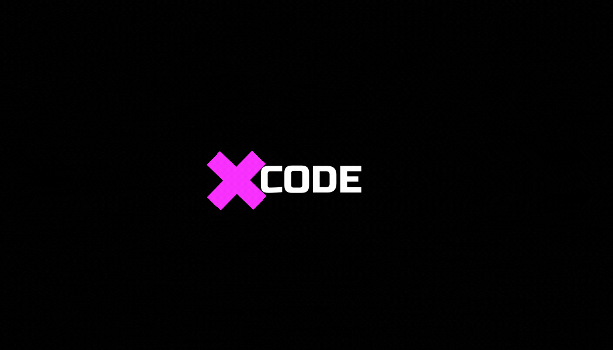

# xcode : Code Editor & Compiler

---

### Repo Stats :-

 

### Language Used :-

### Key Points :-

- In this project we have created an online code editor & compiler.
- We have supported php,c,c++,python and nodejs in this project for running the programs.
- User input work is remaining.
- You will also find some quizes and cheatsheets for the various programming languages.

---

--- 

### Project Maintainers :-

